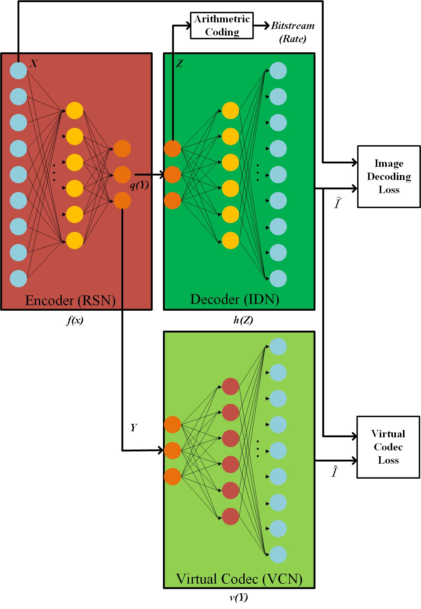
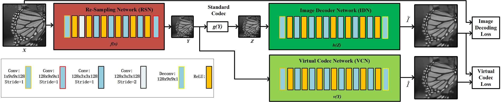

# Virtual Codec Supervised Re-Sampling Network for Image Compression
Author: Lijun Zhao, Huihui Bai, Anhong Wang, Yao Zhao

## Image Re-Sampling Compression Method
Our IRSC method can be not only used for deep neural networks based compression framework (DNNC), but it also can be applied to standard-compliant image compression framework (SCIC).
- DNNC Framework

  
  

- SCIC Framework

  
  
